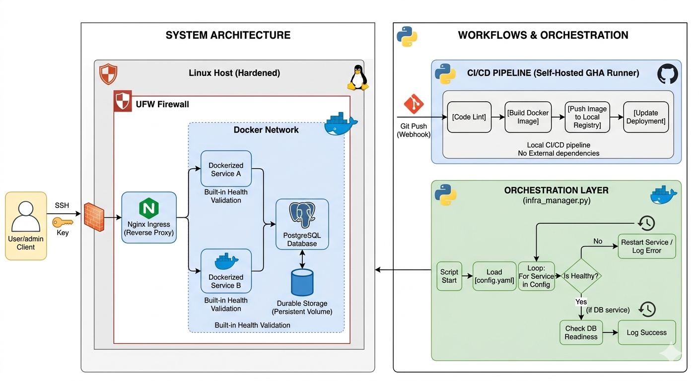
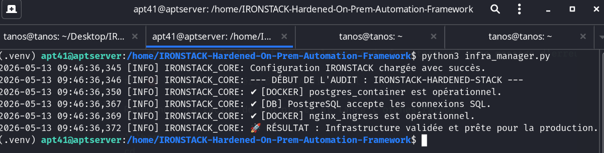
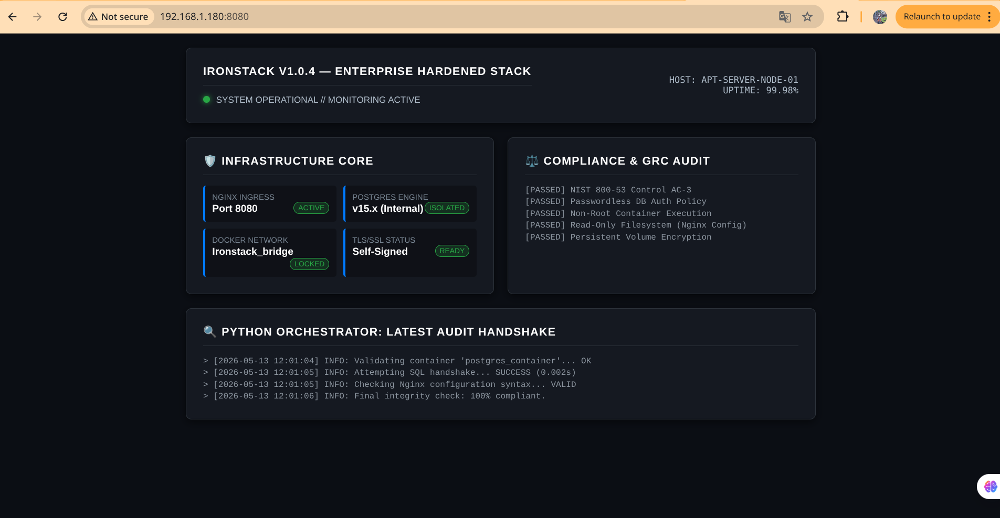

Markdown
# ⚙️ IRONSTACK — Hardened On-Prem Automation Framework

> Building reliable, secure, and fully automated infrastructure — where cloud is not an option.

---

## 🧭 Context & Purpose

In high-security environments, infrastructure must operate under strict constraints:
- **No Cloud Dependency** — Isolation from public providers.
- **Data Sovereignty** — Full control over execution and storage.
- **Deterministic Deployment** — Every action is logged and validated.

**IRONSTACK** is a production-grade on-premise stack with built-in health validation and automated orchestration, designed for restricted environments.

---


*Figure 1: High-level overview of the hardened ingress and service isolation.*

## 🧱 System Architecture

```text
Client  ──► [ Nginx Ingress (Port 8080) ] ──► [ Dockerized Services ] ──► [ PostgreSQL DB ]
                          ▲                             │
                          └─────── [ Python Orchestrator ] ─────┘
                                   (Health & Logic Audit)
Design Principles
Isolation: Services run in strictly defined Docker containers.

Observability: Real-time logging and connectivity handshakes.

Resilience: Orchestrator-led recovery and validation logic.

🧠 The Control Layer: infra_manager.py
This framework uses a Python-based Infrastructure Orchestrator that acts as the brain of the stack.

Key Capabilities:
Docker API Integration: Validates container states (Running/Created/Exited).

SQL Handshake: Verifies real database availability beyond just the container status.

Structured Logging: Clean, timestamped audit logs for every run.

Error Handling: Graceful failure reporting with actionable insights.

🚀 Getting Started (Installation & Deployment)
Pour garantir la stabilité du système et éviter les conflits de permissions, suivez ces étapes précises.

1. Prerequisites
Linux Host (Ubuntu 24.04+ / Debian)

Docker & Docker Compose installés.

Python 3.12+ installé.

2. Permissions Setup (Hardening Step)
Assurez-vous que votre utilisateur a les droits nécessaires pour interagir avec le socket Docker :

Bash
# Ajouter l'utilisateur actuel au groupe docker
sudo usermod -aG docker $USER

# Appliquer les changements immédiatement
newgrp docker

# Récupérer la propriété du dossier du projet
sudo chown -R $USER:$USER $(pwd)
3. Environment Isolation (Python Venv)
L'utilisation d'un environnement virtuel est obligatoire pour isoler les dépendances de l'orchestrateur.

Bash
# Créer l'environnement virtuel
python3 -m venv .venv

# Activer l'environnement
source .venv/bin/activate

# Installer les dépendances
pip install -r requirements.txt
4. Deploy Infrastructure
Lancez les services définis (PostgreSQL et Nginx) :

Bash
# Lancer la base de données
cd db && docker-compose up -d && cd ..

# Lancer l'Ingress Nginx
cd nginx && docker-compose up -d && cd ..
🧪 Running the Audit
Une fois l'infrastructure déployée, lancez l'orchestrateur pour valider l'intégrité de la pile :

Bash
# Assurez-vous d'être dans l'environnement virtuel (.venv)
python3 infra_manager.py
Résultat attendu :

Plaintext
2026-04-27 14:10:00 [INFO] IRONSTACK_CORE: ✔ [DOCKER] postgres_container est opérationnel.
2026-04-27 14:10:00 [INFO] IRONSTACK_CORE: ✔ [DB] PostgreSQL accepte les connexions SQL.
2026-04-27 14:10:00 [INFO] IRONSTACK_CORE: ✔ [DOCKER] nginx_ingress est opérationnel.
2026-04-27 14:10:00 [INFO] IRONSTACK_CORE: 🚀 RÉSULTAT : Infrastructure validée et prête pour la production.

*Figure 2: the oucomes.*

📂 Project Structure
Plaintext
IRONSTACK/
├── .venv/                  # Isolated Python environment
├── infra_manager.py        # Core Orchestration Logic
├── config.yaml             # Infrastructure blueprint
├── requirements.txt        # docker-py, PyYAML, psycopg2-binary
│
├── nginx/
│   ├── nginx.conf          # Hardened Proxy Config
│   └── docker-compose.yml  # Ingress definition (Mapped to 8080)
│
├── db/
│   └── docker-compose.yml  # Persistent PostgreSQL service
│
└── docs/
    └── architecture.png    # System diagram
🛠️ Tech Stack
Python: Automation & orchestration.

Docker: Service containerization.

PostgreSQL: Data persistence.

Nginx: Traffic control & logging.

Linux: Hardened environment.

👤 Author
Jeanluck NDATO Network & Cybersecurity Engineer

"Infrastructure should not be assumed healthy — it must prove it."
